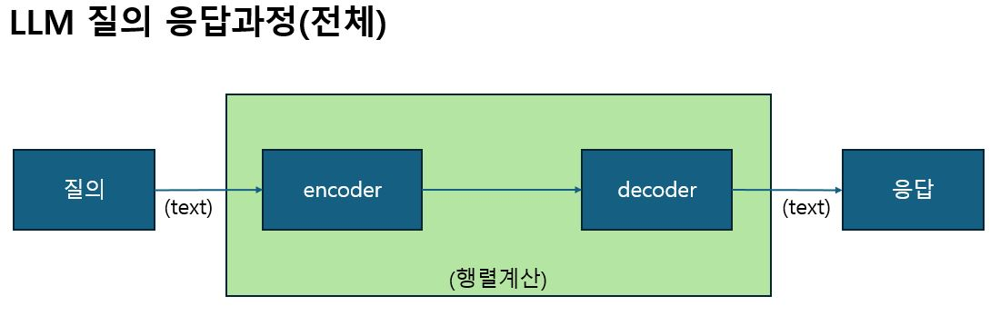
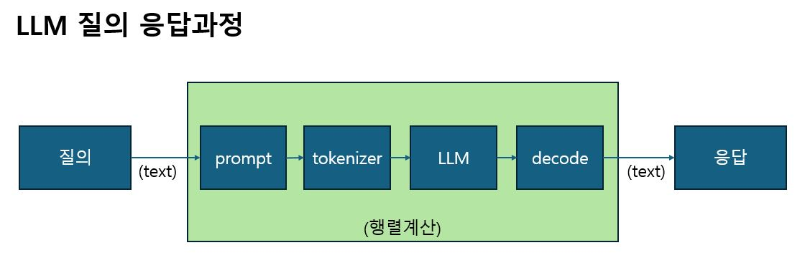
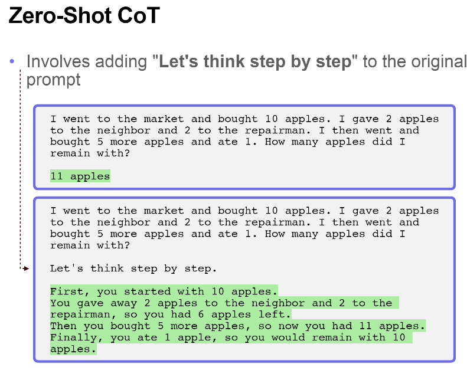
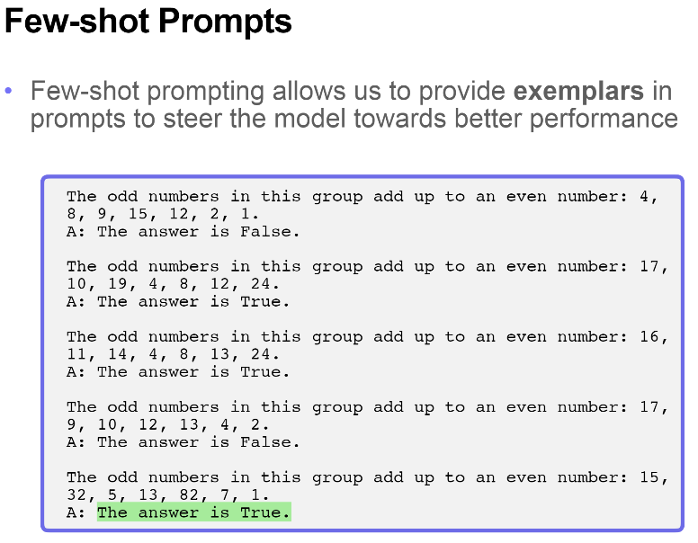
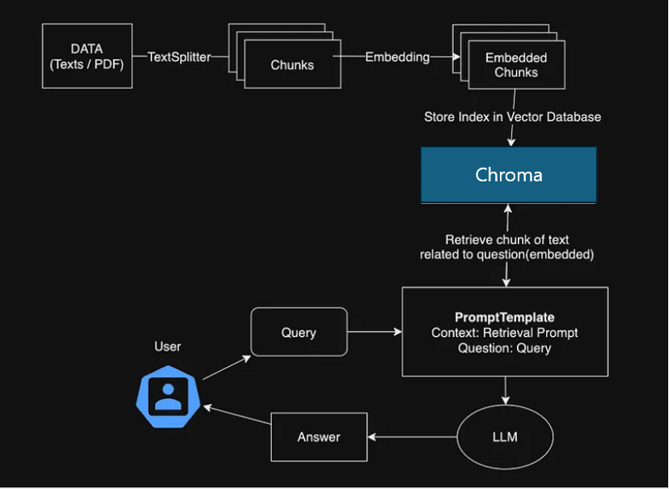

# AIProgramming
## 인공지능 응용

- 2024년 2학년 2학기 인공지능 응용 수업을 들으며 배운 내용들을 정리하여 작성하였습니다.

## 1. 실습 환경 구축<br>
- **리눅스 가상서버 설치**: 리눅스 가상서버를 설정하여 실습 환경을 준비.
- **Xshell, Xftp 설치**: Xshell과 Xftp를 설치하여 리눅스와의 연결을 원활하게 함.
- **가상환경 Anaconda 설치**: Anaconda를 이용해 가상환경을 설정하고 다양한 파이썬 패키지를 관리할 수 있도록 준비.
- **Jupyter 설치**: Jupyter 노트북을 설치하여 코드 작성 및 실행 환경을 구축.
- **Cursor 설치**: 코드 작성에 도움을 주는 AI인 Cursor를 설치하여 활용할 준비 완료.

## 2. LLM 실습 및 할루시네이션 문제 해결<br>
- **LLM 예제 실습**: LLM(대형 언어 모델)을 활용한 예제 실습을 진행하며, 실습 중 할루시네이션 문제 발생.





## **할루시네이션 문제**<br>
LLM에서의 할루시네이션 문제는 모델이 부정확하거나 사실이 아닌 정보를 생성하는 현상을 말합니다. 할루시네이션은 여러 요인으로 발생할 수 있습니다:

- **학습 데이터**: 모델이 학습한 데이터의 품질이 낮거나 부정확한 경우, 잘못된 답변을 생성할 수 있습니다.
- **잘못된 가정**: 모델이 입력받은 질문이나 맥락을 잘못 해석할 때 발생합니다. 예를 들어, 모델이 주어진 정보를 잘못 연결하거나 이해할 수 있습니다.
- **데이터 편향**: 학습 데이터에 편향이 있을 경우, 모델의 출력이 특정 방향으로 치우칠 수 있습니다.

## **할루시네이션 극복 방법**<br>
할루시네이션 문제를 해결하기 위한 방법 중 하나는 **Zero-shot**과 **Few-shot** 학습 접근 방식을 사용하는 것입니다.

### 1. **Zero-shot 학습**<br>
Zero-shot 학습은 모델이 특정 작업을 수행할 수 있도록 학습되지 않은 상황에서 직접 질문을 처리하는 방식입니다. 즉, 모델은 이전에 본 적 없는 작업에 대해서도 일반적인 지식을 바탕으로 추론하여 답을 생성하려 시도합니다. 이 방식은 특정 작업에 대한 명시적인 학습 없이도 모델이 더 넓은 범위의 문제를 해결할 수 있게 해줍니다.



- **장점**: 모델이 특정 태스크에 대해 사전 학습이 필요하지 않아 빠르게 적용할 수 있습니다.
- **단점**: 모델의 성능이 제한적일 수 있으며, 너무 특화된 작업에는 효과적이지 않을 수 있습니다.

### 2. **Few-shot 학습**<br>
Few-shot 학습은 모델이 주어진 몇 가지 예시를 통해 새로운 작업을 수행하는 방식입니다. 몇 개의 샘플만으로 모델이 일반화하여 다른 유사한 작업을 수행할 수 있게 됩니다. 이 접근법은 특히 특정 도메인에서 모델을 더 정확하게 조정하고, 할루시네이션 문제를 완화하는 데 유용할 수 있습니다.



- **장점**: 모델이 기존 데이터를 통해 학습한 패턴을 바탕으로 새로운 태스크에 대해 비교적 높은 성능을 보일 수 있습니다.
- **단점**: 여전히 너무 적은 샘플로는 모델의 성능을 극대화하기 어렵고, 일부 태스크에서는 충분한 성능을 발휘하지 못할 수 있습니다.

### **Zero-shot과 Few-shot을 통한 할루시네이션 극복**<br>
- **Zero-shot**을 사용하면, 모델이 사전 지식에 의존하여 할루시네이션을 최소화하려고 시도합니다. 하지만 완전히 새로운 영역에서는 여전히 부정확한 결과를 생성할 가능성이 존재합니다.
- **Few-shot** 학습을 통해 특정 영역에 대해 보다 정교한 모델을 구축할 수 있으며, 할루시네이션을 줄이고 더 나은 응답을 생성할 수 있습니다. 예시를 제공함으로써 모델이 더 정교한 추론을 할 수 있게 되며, 이는 정확한 정보 생성에 도움이 됩니다.

이러한 방식들은 **RAG (Retrieval-Augmented Generation)** 기술과 결합되어 외부 데이터베이스나 최신 정보를 참고함으로써, 할루시네이션을 보다 효과적으로 줄일 수 있습니다.

- **RAG 방식 학습**: RAG(검색 기반 생성) 방식에 대해 학습. 외부 정보를 검색하여 더 정확한 답변을 제공하는 방식임.



- **Loader의 이해**: RAG 방식을 사용할 때 데이터를 학습시킬 수 있도록 Loader를 사용하는 방법을 학습.

## 3. 실습 환경 구성 및 AI 모델 사용<br>
- **LLM 사용에 필요한 도구 설치**: LLM을 실행하기 위해 리눅스 모듈, 파이썬 모듈 설치.
- **Hugging Face 토큰 및 OpenAI API 토큰 발급**: LLM 모델을 사용하기 위해 필요한 토큰을 발급받고, 이를 활용.
- **LLM 학습에 필요한 문서 준비**: LLM 모델에 학습시킬 문서들을 준비하고, 이를 모델에 입력할 준비 완료.

## 4. 성능 최적화 및 문제 해결<br>
- **LLM 모델 설치**: 모델 다운로드 시간이 오래 걸렸으며, 교수님이 미리 다운로드한 LLM 파일을 복사하여 빠르게 설정 완료.
- **답변 속도 및 정확도 문제 해결**: 실습실 컴퓨터에서 그래픽 카드가 없어 답변 속도가 느렸으나, 그래픽 카드가 있는 개인 컴퓨터에서 더 빠른 속도의 답변을 받음.

## 5.: RAG 기술 적용 및 할루시네이션 해결<br>
- **RAG 기술 적용**: RAG 기술을 사용하여 할루시네이션 문제를 해결. RAG는 외부에서 최신 정보를 검색하여 생성된 답변에 포함시키는 방식으로, 더 정확하고 신뢰성 있는 답변을 제공.
- **Loader 사용**: RAG 방식에서 AI 모델에게 학습시킬 데이터를 입력하기 위해 문서 파일을 Loader를 통해 학습시켜야 함.

# **AI 기반 챗봇 시스템**<br>
이 프로젝트는 **OpenAI API**와 **Flask**를 이용하여 학기 동안 배운 내용을 바탕으로 만든 AI 기반 챗봇 시스템입니다. 이번 프로젝트를 통해 **LLM 모델**의 작동 원리, **RAG (Retrieval-Augmented Generation)** 기술, 그리고 **Flask 웹 프레임워크**를 활용한 실습을 통해 AI 모델을 웹 애플리케이션에 통합하는 방법을 배웠습니다.

## **프로젝트 개요**<br>
이 챗봇 시스템은 사용자가 질문을 입력하면 OpenAI API를 통해 AI 모델을 호출하고, 그에 맞는 답변을 출력하는 웹 애플리케이션입니다. 시스템은 다음과 같은 기능을 제공합니다:

- **사용자 입력 처리**: 사용자가 입력한 질문을 Flask 서버로 전송합니다.
- **OpenAI API 호출**: Flask 서버가 OpenAI API를 호출하여 해당 질문에 대한 답변을 생성합니다.
- **답변 출력**: 생성된 답변을 사용자에게 웹 페이지에서 실시간으로 출력합니다.

## **기술 스택**<br>
- **OpenAI API**: GPT-3와 GPT-4를 기반으로 한 LLM 모델을 이용하여 자연어 처리 및 응답 생성.
- **Flask**: Python으로 작성된 웹 애플리케이션 프레임워크로, 사용자와 AI 모델 간의 상호작용을 처리.
- **HTML/CSS/JavaScript**: 웹 인터페이스를 디자인하고, 사용자와의 실시간 상호작용을 처리.
- **RAG (Retrieval-Augmented Generation)**: 외부 데이터를 검색하여 AI 모델의 답변 정확도를 높이는 기술.
- **Python**: Flask 서버와 OpenAI API를 호출하기 위한 주요 프로그래밍 언어.

## **프로젝트 목적**<br>
이 프로젝트의 주요 목적은 **OpenAI API**와 **Flask**를 사용하여 실시간으로 AI 모델을 활용한 질문-응답 시스템을 구축하는 것입니다. 이를 통해 **RAG 기술**을 적용하여 더 정확하고 신뢰할 수 있는 답변을 생성하며, 사용자 경험을 향상시킬 수 있었습니다.

## **주요 학습 내용**<br>
- **OpenAI API 활용**: OpenAI API를 사용하여 GPT 모델을 호출하고, 이를 통해 자연어 처리를 구현하는 방법을 배웠습니다.
- **Flask 웹 개발**: Flask를 사용하여 간단한 웹 애플리케이션을 구축하고, 이를 통해 OpenAI API와 상호작용하는 방법을 실습했습니다.
- **할루시네이션 문제 해결**: 모델의 할루시네이션 문제를 이해하고, **Zero-shot**과 **Few-shot** 학습을 통해 이를 해결하는 방법을 배웠습니다.
- **RAG 기술**: 외부 데이터를 검색하여 더 정확한 답변을 생성하는 **Retrieval-Augmented Generation** 기술을 적용했습니다.
- **웹 애플리케이션 구축**: HTML, CSS, JavaScript를 사용하여 사용자 인터페이스를 디자인하고, 이를 Flask 서버와 연결하여 실시간 상호작용이 가능하도록 구현했습니다.

## **프로젝트 구성**<br>
1. **`app.py`**: Flask 애플리케이션의 메인 파일로, 서버를 실행하고 OpenAI API와의 통신을 처리합니다.
2. **`templates/index.html`**: 사용자 인터페이스를 위한 HTML 파일로, 사용자가 질문을 입력하고 답변을 받을 수 있는 페이지를 제공합니다.
3. **`static/styles.css`**: 웹 페이지 디자인을 위한 CSS 파일입니다.
4. **`static/script.js`**: 사용자 인터페이스와 Flask 서버 간의 상호작용을 처리하는 JavaScript 파일입니다.

## **실행 방법**<br>
1. 필요한 Python 라이브러리 설치:
    ```bash
    pip install openai flask
    ```

2. OpenAI API 키를 설정:
    - OpenAI의 [API 키](https://platform.openai.com/)를 발급받고, 이를 환경 변수에 설정합니다.

3. Flask 애플리케이션 실행:
    ```bash
    python app.py
    ```

4. 웹 브라우저에서 `http://127.0.0.1:5000/`를 열어 챗봇 시스템을 사용합니다.

## **Flask 애플리케이션 코드 (app.py)**

```python
from flask import Flask, render_template, request, jsonify
import os
from dotenv import load_dotenv
from langchain.vectorstores import Chroma
from langchain.embeddings.openai import OpenAIEmbeddings
from openai.types.chat import ChatCompletionMessageParam
import openai

# 환경 변수 로드
load_dotenv()
openai.api_key = os.getenv("OPENAI_API_KEY")

app = Flask(__name__)

class DocumentQABot:
    def __init__(self, model_name="gpt-3.5-turbo", persist_directory='chroma_store'):
        self.model_name = model_name
        self.embeddings = OpenAIEmbeddings()
        self.vectorstore = Chroma(
            persist_directory=persist_directory,
            embedding_function=self.embeddings
        )

    def build_prompt(self, query, context):
        system_message: ChatCompletionMessageParam = {
            "role": "system",
            "content": """다음 제공된 컨텍스트만을 기반으로 질문에 답변해주세요.
            컨텍스트에 충분한 정보가 없다면 '확실하지 않습니다'라고 말한 후 추측해주세요.
            답변은 읽기 쉽게 단락으로 나누어 주세요."""
        }
        
        user_message: ChatCompletionMessageParam = {
            "role": "user",
            "content": f"질문: {query}\n\n제공된 컨텍스트:\n{context}"
        }
        
        return [system_message, user_message]

    def get_response(self, query, context):
        try:
            response = openai.chat.completions.create(
                model=self.model_name,
                messages=self.build_prompt(query, context)
            )
            return response.choices[0].message.content
        except Exception as e:
            return f"오류가 발생했습니다: {str(e)}"

    def search_documents(self, query, k=5):
        results = self.vectorstore.similarity_search(
            query=query,
            k=k
        )
        return [doc.page_content for doc in results]

# 봇 인스턴스 생성
bot = DocumentQABot()

@app.route('/')
def home():
    return render_template('index.html')

@app.route('/ask', methods=['POST'])
def ask():
    data = request.json
    query = data.get('question', '')
    
    if not query:
        return jsonify({'error': '질문을 입력해주세요.'})

    # 문서 검색
    relevant_docs = bot.search_documents(query)
    
    if not relevant_docs:
        return jsonify({'answer': '관련 문서를 찾을 수 없습니다.'})

    # 답변 생성
    context = " ".join(relevant_docs)
    response = bot.get_response(query, context)
    
    return jsonify({'answer': response})

if __name__ == '__main__':
    app.run(debug=True) 
```

## **프로젝트 결과**<br>
이 프로젝트는 **LLM 모델**을 웹 애플리케이션에 통합하여 실시간으로 질문을 받고 답변을 생성하는 시스템을 성공적으로 구현했습니다. 또한 **할루시네이션** 문제를 해결하기 위해 **Zero-shot** 및 **Few-shot** 방법을 적용하고, **RAG** 기술을 사용하여 답변의 정확도를 높였습니다.

## **향후 개선 사항**<br>
- **사용자 데이터 저장**: 사용자의 질문과 답변을 저장하여 모델의 성능을 개선할 수 있는 피드백 시스템을 구축할 예정입니다.
- **멀티 언어 지원**: 다양한 언어로 질문을 처리할 수 있는 다국어 지원을 추가할 계획입니다.
- **UI/UX 개선**: 사용자 경험을 향상시키기 위해 웹 인터페이스를 개선하고, 더 직관적인 디자인을 제공할 예정입니다.

---

이 프로젝트는 **AI 모델**과 **웹 개발**을 결합하여 실제 문제를 해결하는 방식으로, 학기 동안 배운 내용을 실습하고 적용하는 기회를 제공했습니다. Flask와 OpenAI API를 사용하여 실제로 동작하는 챗봇 시스템을 구축하면서, AI 기술을 실용적인 웹 애플리케이션으로 구현하는 방법을 배우게 되었습니다.
